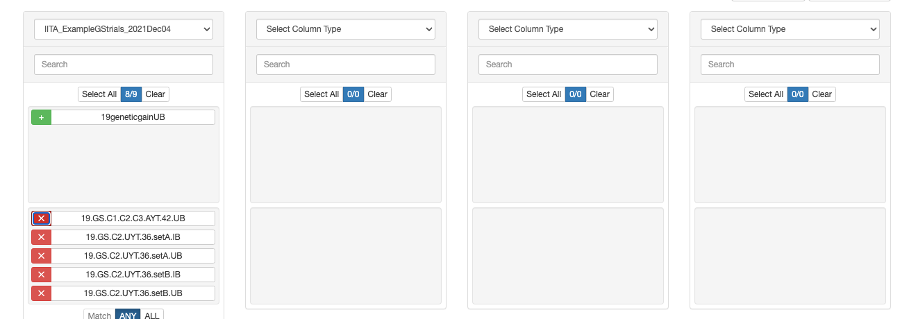
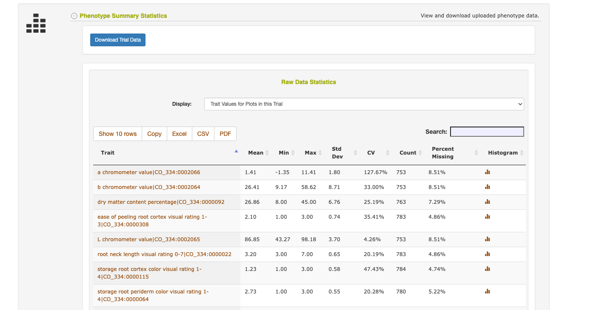
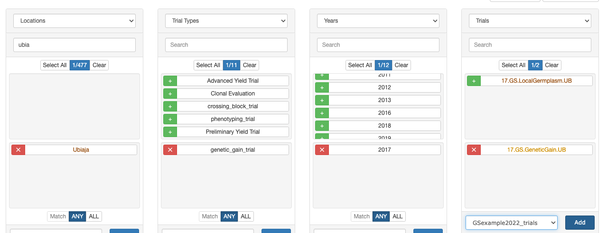
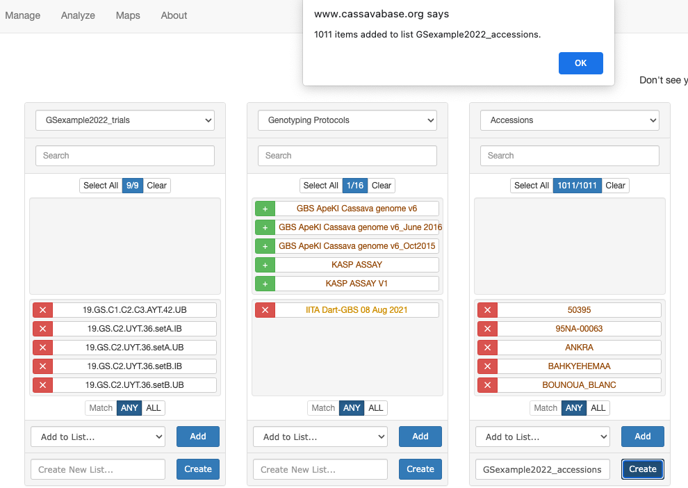
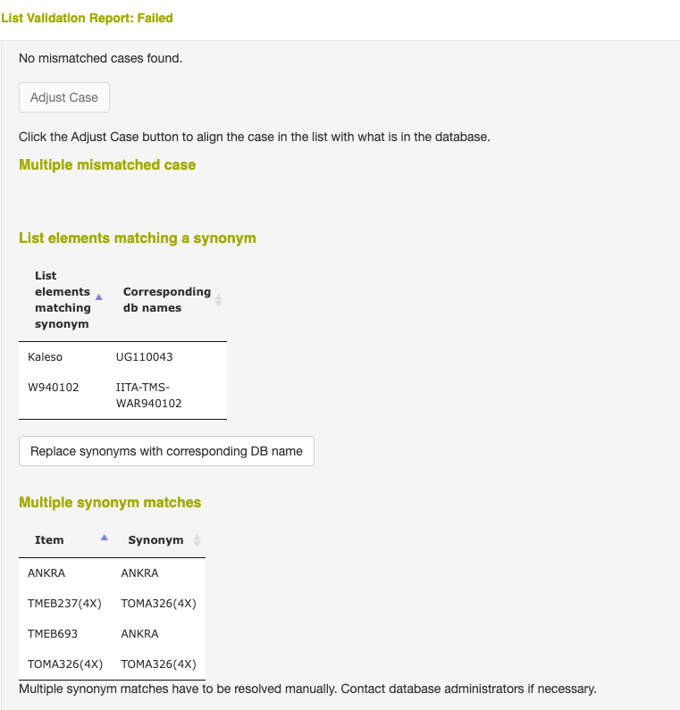

Let's start with the instructions for [downloading training data](https://wolfemd.github.io/GenomicSelectionManual/download-training-data.html).

I'll take screenshots as I go, for posterity.

## Create trial list

In the Manual, I created a list already: "**IITA_ExampleGStrials_2021Dec04**", it's public so all participants can access.

I'll start with that in the Wizard.

In the manual, 1 trial "19geneticgainUB" turned out not to have phenotypes recorded. Let's remove it, and pick a different "genetic gain" trial.

Save list (without genetic gain trial): "**GSexample2022_trials**"

Used the wizard to select: "17.GS.GeneticGain.UB"

Double-clicked the trial name in the wizard to go to the trial page: <https://www.cassavabase.org/breeders/trial/5337>

Checked out the "Phenotype Summary Statistics" page to verify that there *is* data for this trial.

Added the trial to the "GSexample2022_trials" list, like so:

I also made the trial list public so all workshop participants can use the same.

## Download related trial data

Follow the manual instructions exactly from here.

1.  Download phenotype.csv
2.  Download metadata.csv

## Make accession list

Create list: "GSexample2022_accessions"

## Validate accession list

Follow the manual. After clicking "Validate" it takes some time...

As in the manual, I fix it by removing accessions... for your *real* population, you might not want to do that. Talk to your data managers!

Remove: "**Kaleso**", "**W940102", "ANKRA" and** "**TOMA326(4X)**"

Re-validate the list. **List passes validation! Success!**

Set list to public so everyone in workshop can use.

## Download  genotype data

Follow manual to download. It will not be quick, do *outside* of workshop demo!

Move downloaded `.vcf` file to `data/` directory.

## Download pedigree

Move downloaded `pedigree.txt` file to `data/` directory.
