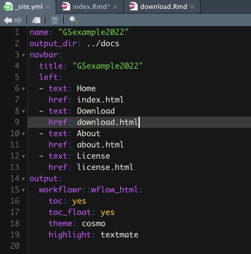
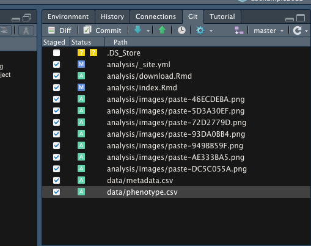
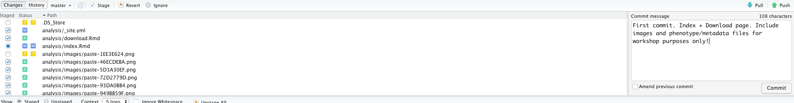
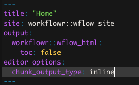

Welcome to my example GS repository. I followed the instructions [here](https://wolfemd.github.io/GenomicSelectionManual/create_project.html) to create this project.

I'm going to follow along the [Genomic Selection Manual](https://wolfemd.github.io/GenomicSelectionManual/) throughout this project.

## Data download

Create the "download.Rmd"

```{r, eval=F}
wflow_open("analysis/download.Rmd")
```

Link to it: [Data Download Stage](download.html)

Add it to the top navigation bar, via the `_site.yml` file:



## Table of Contents

1. [Data Download Stage](download.html)
2. [Clean phenotype data](clean_phenos.html): standard procedures to prepare phenotypes for analysis.
3. [Prepare genotypic data](prep_genos.html): standard procedures to prepare genotypic inputs (e.g. haplotype matrices) for genomic mate selection analyses.
4. [Preliminary field trial analyses](get_blups.html): Conduct preliminary analysis of the trial data without genomic relatedeness / marker-information. Identify the best-fitting model for the data and potentially curate the raw data, removing outliers. Fit mixed-model to MET data. Extract BLUPs, PEVs and variance components (VarComps). Compute de-regressed BLUPs (drgBLUPs) and weights (WTS) for “Stage 2.”
5. [Introduction to Genomic Prediction in R](intro_gp.html): Into to using `sommer` to fit G-BLUP and RR-BLUP models, a demo of their equivalency and quickly showing how to run cross-validations with the `runCrossVal()` function of `library(genomicMateSelectR)`.
6. [Check prediction accuracy](kfoldcrossval.html): Use what we learned previously to run a k-fold cross-validation and estimate the accuracy predicting the performance of parents on our selection index.
7. [Predict parental GEBV](get_gebv.html): Having checked prediction accuracy and assuming we are satisfied, we can now run the full genomic prediction using `runGenomicPredictions()` and get GEBV for our population, computing the selection index performance using those GEBVs for our ultimate selections of parents.
8. [Parent-wise Cross-validation](parentwise_cv.html): Check the accuracy predicting the means, variances and covariances in previously untested crosses. _Also_ verify using marker data that the pedigree is correct, before doing the parent-wise CV.
9. [Predict crosses](pred_crosses.html): The main event. Predict the means, variances and usefulness on the selection index and select the top crosses.

**TROUBLESHOOTING RMD:** [Troubleshooting each step](troubleshooting.html)

## Committing and publishing 

Example, first commit:



**VERY IMPORTANT NOTE:** here I'm adding the `data/metadata.csv` and `data/phenotype.csv`. These are small files and I want them available to workshop users. DO NOT make a habit of this. GitHub max size is 25 Mb. ESPECIALLY DO NOT add genomic data files to your Git version control.



## Publishing to GitHub Pages

Follow the manual's instructions at: <https://wolfemd.github.io/GenomicSelectionManual/create_project.html#publishing-on-github-pages>

In addition, edit repository details, adding the GitHub pages web address and a short description, like so:


Consider modifying the `README.md` file in the main project folder, as it will display to anyone viewing the repository directly on GitHub.


## Customize `workflowR` project

### Inline chunk output

Change chunk output setting to "inline output" instead of "console"


